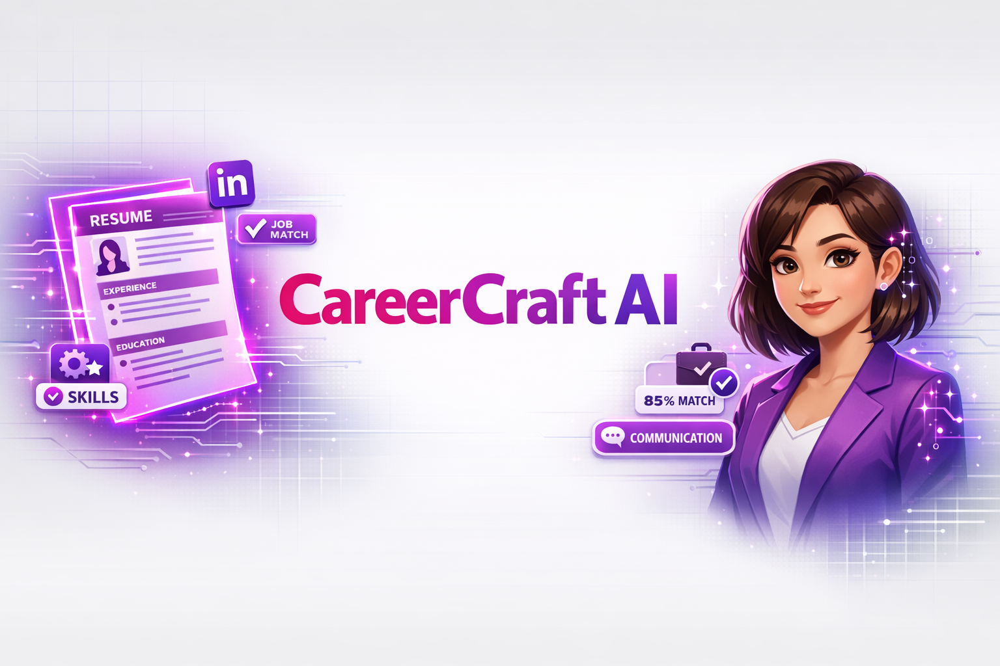

# CareerCraft AI - LinkedIn Resume & Cover Letter Generator



## Overview

CareerCraft AI is a modern web application that helps users create professional resumes and cover letters through an AI-powered conversational interface. Built with Flask, React, and Claude AI, it provides an intuitive two-step process for generating tailored career documents.

## Features

### Core Functionality
- **AI-Powered Conversation**: Interactive chat with Aria, your AI career assistant
- **Two-Step Process**: 
  1. Gather user information through natural conversation
  2. Generate professional resume based on collected data
- **Real-Time Preview**: Live HTML preview of generated resumes
- **Multiple Export Formats**: Download as PDF or DOCX
- **Share Functionality**: Generate public URLs to share resumes
- **Resume History**: Browse, search, and manage all your resumes
- **Settings Page**: Customize profile and notification preferences

### Token Monitoring
- Real-time token usage tracking
- Interactive charts and statistics
- Auto-refresh dashboard
- Cost monitoring

## Tech Stack

### Backend
- **Flask**: Python web framework
- **Claude AI (Anthropic)**: AI conversation and content generation
- **SQLite**: Database for resume storage
- **Python 3.11**: Core language

### Frontend
- **React 18**: UI framework
- **TypeScript**: Type-safe development
- **Vite**: Build tool and dev server
- **Tailwind CSS**: Styling
- **Radix UI**: Component library
- **Lucide React**: Icons

## Project Structure

```
/workspace
├── app.py                          # Main Flask application
├── resume_generator.py             # Resume generation logic
├── requirements.txt                # Python dependencies
├── client/                         # React frontend
│   ├── src/
│   │   ├── components/            # React components
│   │   ├── pages/                 # Page components
│   │   ├── lib/                   # Utilities
│   │   └── App.tsx                # Main app component
│   ├── package.json               # Node dependencies
│   └── vite.config.ts             # Vite configuration
├── token_monitor/                  # Token monitoring service
│   ├── app.py                     # Token monitor Flask app
│   └── templates/                 # Monitor UI templates
├── static/                         # Built frontend assets
├── templates/                      # Flask templates
└── tests/                          # Test files
```

## Installation

### Prerequisites
- Python 3.11+
- Node.js 18+
- npm or yarn

### Setup

1. **Clone the repository**
```bash
git clone <repository-url>
cd careercraft-ai
```

2. **Install Python dependencies**
```bash
pip install -r requirements.txt
```

3. **Install Node dependencies**
```bash
cd client
npm install
cd ..
```

4. **Set up environment variables**
Create a `.env` file in the root directory:
```env
ANTHROPIC_API_KEY=your_claude_api_key_here
```

5. **Build the frontend**
```bash
cd client
npm run build
cd ..
```

## Running the Application

### Development Mode

**Terminal 1 - Backend:**
```bash
python app.py
```
The Flask app will run on `http://localhost:9000`

**Terminal 2 - Frontend (Hot Reload):**
```bash
cd client
npm run dev
```
The Vite dev server will run on `http://localhost:5173`

**Terminal 3 - Token Monitor:**
```bash
cd token_monitor
python app.py
```
The token monitor will run on `http://localhost:9010`

### Production Mode

1. Build the frontend:
```bash
cd client
npm run build
cd ..
```

2. Copy built files:
```bash
cp -r client/dist/* static/
cp client/dist/index.html templates/
```

3. Run the Flask app:
```bash
python app.py
```

## API Endpoints

### Main Application
- `GET /` - Main application interface
- `POST /api/chat` - Send message to AI assistant
- `POST /api/generate-resume` - Generate resume from conversation
- `GET /api/resumes` - Get all user resumes
- `GET /api/resume/<id>` - Get specific resume
- `DELETE /api/resume/<id>` - Delete resume
- `GET /api/share/<share_id>` - View shared resume

### Token Monitor
- `GET /api/usage/timeline` - Get token usage timeline
- `GET /api/usage/stats` - Get usage statistics

## Features in Detail

### Resume Generation Flow
1. User starts conversation with Aria
2. AI asks relevant questions about experience, skills, education
3. User provides information naturally through chat
4. AI generates professional resume using collected data
5. User can preview, download, or share the resume

### Resume History
- View all generated resumes
- Search by title or content
- Delete unwanted resumes
- Quick access to download and share

### Settings
- Update profile information (name, email)
- Configure notification preferences
- Settings persist across sessions

## Configuration

### Flask Configuration
- `DEBUG`: Set to `False` in production
- `PORT`: Default 9000 (configurable)
- `HOST`: Default 0.0.0.0

### Frontend Configuration
- Vite proxy configured for API calls
- Tailwind CSS for styling
- TypeScript for type safety

## Database Schema

### Resumes Table
```sql
CREATE TABLE resumes (
    id INTEGER PRIMARY KEY AUTOINCREMENT,
    title TEXT NOT NULL,
    content TEXT NOT NULL,
    html_content TEXT,
    created_at TIMESTAMP DEFAULT CURRENT_TIMESTAMP,
    share_id TEXT UNIQUE
)
```

## Contributing

1. Fork the repository
2. Create a feature branch (`git checkout -b feature/amazing-feature`)
3. Commit your changes (`git commit -m 'Add amazing feature'`)
4. Push to the branch (`git push origin feature/amazing-feature`)
5. Open a Pull Request

## Future Enhancements

- **Resume Editing & Refinement**: Inline editing, AI-powered section regeneration
- **Multiple Templates**: Various resume designs and layouts
- **Cover Letter Generation**: Dedicated cover letter creation flow
- **Job Matching**: AI-powered job recommendation based on resume
- **Collaborative Editing**: Share and get feedback on resumes
- **Version History**: Track changes and restore previous versions

## License

This project is licensed under the MIT License.

## Support

For issues, questions, or contributions, please open an issue on GitHub.

## Acknowledgments

- Built with [Claude AI](https://www.anthropic.com/) by Anthropic
- UI components from [Radix UI](https://www.radix-ui.com/)
- Icons from [Lucide](https://lucide.dev/)

---

**Made with ❤️ for job seekers everywhere**